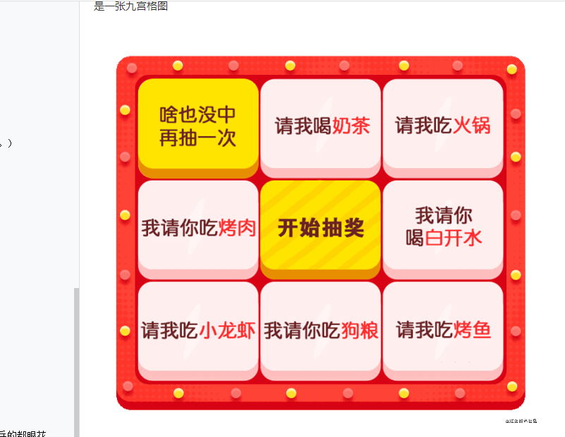

## 背景

带着我的小耳机坐在电脑前正YY着自己的女神（哦不，像我这么认真，负责，肯定是在狂飞乱舞的码着代码）

肩膀突然被人拍了一下，吓得我第一反应是Alt+Tab键切换了屏幕，屏幕正前方是显示着一行行代码（我可是在认真的工作）

一切动作如行云流水般，这一切不留痕迹的，（小兵兵可是很聪明的）一本正经的缓缓的转过头

映入眼帘的是...心脏慢慢的开始跳动起来，一位穿着休闲白色衣服的女生出现在了我眼前，那女孩有一双晶亮的眸子,明净清澈,灿若繁星,此时不知她想到了什么，嘴角挂着一抹莫名的笑意，

“小兵兵，嘿嘿，上班时间在干嘛呢，我可看到了”，露出那仿佛抓到小把柄的微笑

“嘿嘿，上班我还能干什么，认真工作呗，，小鹿鹿，怎么，过来找我，又要来剥削我了”，此时看到她那狡黠的笑容，我感到阵阵发冷，每次找我总会有不好的事情发生，不无镇定的说道

“哈哈哈 ，睁着眼都能说瞎话...，我都在这站半天了，我可什么都看到了，什么叫剥削，说人话”,捂着嘴偷笑了出来，

"你说，姑奶奶，我怕了，你说过来干什么"

“没事，别紧张，我只是有一个需求需要你来对接一下，很简单的，很容易实现的”

“每次都说简单，后面接着需求一大推，你看我的头发，掉了一根又一根了，头发都快秃了”，我抓着这为数不多的头发，愤恨的说道，

“哈哈哈，忙完了我请你喝奶茶去，这是这次的需求，要做一个抽奖的九宫格，公司要举行活动，需要用到”，打开需求地址，映入眼帘的是一张九宫格图



“呵呵，我是能被一杯奶茶收买的吗，肯定不行，要两杯”，笃定的说到

“哈哈哈，原来你是这样的人。。。”

啪啪啪的看着需求，进行分析，看图就知道这是一个典型的活动页，抽奖九宫格，中间点击按钮进行开始，然后进行滚动抽奖


## 思考
- 1、找个插件直接干，分分钟的事
- 2、canvas画
- 3、原生写

## 选型
为了能够提现小兵兵那出神入化的技术，用别人的插件那是不可能的，肯定是自己动手写（其实只是看不懂别人的，装逼失败，。。。）

## 思路
- 初始化用户配置
- 开始装配转盘
- 绑定抽奖事件
- 禁用抽奖 防止重复进行点击
- 转盘加速
- 转盘匀速
- 减速之前的操作，支持用户追加操作（例如：从后台获取中奖号）
- 转盘减速
- 转盘滚动
- 转盘停止，还原设置
- 转盘当前格子下标
- 转盘总格子数
- 获取中奖号，用户可重写该事件，默认随机数字

小兵兵的独特的设计思路，为了能实现复用性，是不是很厉害，很牛逼（让我嘚瑟一会，是不是看着上面这么多步骤头晕眼花，小兵兵的都眼花了，那接下来一步一步的实现这些骚操作

## 实现
- HTML布局
- CSS布局
- JS逻辑代码

### 效果预览

[github预览地址](https://zouzhibin.github.io/lottery/)


### html代码布局
```
<div id="wrap-log">
        <div>
            <div data-name="0" class="inner active">啥也没中在抽一次</div>
            <div data-name="1" class="inner">请我喝奶茶</div>
            <div data-name="2" class="inner">请我吃火锅</div>
            <div data-name="3" class="inner">我请你吃烤肉</div>
            <div id="btnLottery">点击抽奖</div>
            <div data-name="4" class="inner">我请你喝白开水</div>
            <div data-name="5" class="inner">请我吃小龙虾</div>
            <div data-name="6" class="inner">我请你吃狗粮</div>
            <div data-name="7" class="inner">请我吃烤鱼</div>
        </div>
    </div>
```
### css样式
```
<style>
    * {
        margin: 0;
        padding: 0;
    }
    #wrap-log {
        width: 310px;
        height: 310px;
        background: #d80215;
        margin: 100px auto;
        display: flex;
        justify-content: center;
        align-items: center;
        font-size: 15px;
        border-radius: 4px;
        padding-left: 2px;
    }
    .inner {
        border-radius: 8px;
        width: 100px;
        height: 100px;
        display: flex;
        font-size: 18px;
        text-align: center;
        justify-content: center;
        align-items: center;
        background: #ffeeee;
        float: left;
        margin: 1px;
    }
    .active {
        background: aqua;
    }
    #btnLottery {
        border-radius: 8px;
        width: 100px;
        height: 100px;
        font-size: 18px;
        display: flex;
        justify-content: center;
        align-items: center;
        margin: 1px;
        background: yellow;
        float: left;
    }
</style>
```
### js实现
```
<script>
        window.onload = function () {
            let btnLottery = document.querySelector("#btnLottery")
            let inner = document.querySelectorAll(".inner")
            var time, time1, time2, time4;
            let defaultConfig = {
                index: 0, // 初始位置
                speed: 200, // 当前转动速度
                downMax: 1000, // 减速上限
                waiting: 500,  // 减速上限
                isRuning: false, // 当前是否正在抽奖
                upMax: 100,   // 速度上限
            }

            // 绑定点击开始抽奖事件
            function btnClickAction() {
                rollup()
            }
            // 绑定点击事件
            btnLottery.addEventListener("click", btnClickAction)

            // 当点击抽奖的时候 开启一个定时器运动 把当前的class去掉 下一个添加新的class
            function rollup() {
                inner[_index()].className = "inner "
                ++defaultConfig.index
                btnLottery.removeEventListener("click", btnClickAction) //  // 禁用抽奖 防止重复进行点击
                inner[_index()].className = "inner active"
                time = setTimeout(() => {
                    rollup()
                }, defaultConfig.speed)
                // 当前是否正在抽奖  如果正在抽奖
                if (!defaultConfig.isRuning) {
                    _up()
                    defaultConfig.isRuning = true
                }
            }
            // 进行加速运动
            function _up() {
                // 是否当前的转速时间小于最大的速度
                if (defaultConfig.speed <= defaultConfig.upMax) {
                    _constant()
                } else {
                    defaultConfig.speed -= 50
                    time1 = setTimeout(() => {
                        _up()
                    }, defaultConfig.speed)

                }
            }
            // 有3秒时间进行匀速运动
            function _constant() {
                clearTimeout(time1)
                time2 = setTimeout(() => { _down() }, defaultConfig.waiting)
            }
            // 停止活动了 进行运动停止 转盘停止，还原设置
            function _stop() {
                clearTimeout(time)
                clearTimeout(time4)
                btnLottery.addEventListener("click", btnClickAction)
                defaultConfig.isRuning = false
                defaultConfig.speed = 200
                alert(`${inner[_index()].innerHTML}`)
            }
            // 判断在某个条件下是否该进行停止跑马灯效果运动
            function _down() {
                // 可以判断在某个值进行停下来
                if (defaultConfig.speed > defaultConfig.downMax && _index() === Math.round(Math.random()*inner.length)) {
                    _stop()
                } else {
                    clearTimeout(time2)
                    defaultConfig.speed += 100
                    time4 = setTimeout(() => { _down() }, defaultConfig.speed)
                }
                console.log(defaultConfig.speed, _index(), defaultConfig.index)
            }
            // 获取_index 进行取余来代替index 余数肯定不会大于他的最大个数
            function _index() {
                return defaultConfig.index % inner.length
            }
        }

    </script>
```

## 源码地址
啦啦啦，我是码代码的小码农，最后放上我的github源代码地址
[github地址](https://zouzhibin.github.io/lottery)